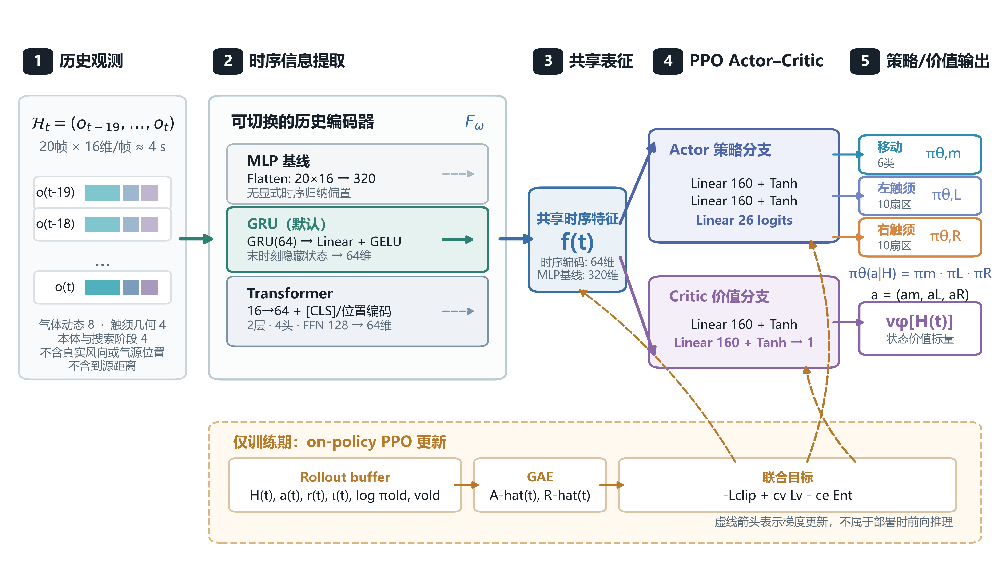

# 3 双触须主动采样与强化学习搜索算法

## 3.1 部分可观测决策建模

由于智能体无法观测完整羽流状态、瞬时风场和真实气源位置，同时气体传感器输出还具有内部动态记忆，因此更准确地说，本任务属于部分可观测马尔可夫决策过程。记隐藏环境状态为 $s_t$，其中包含机器人真实位姿、气源位置、全部 puff 状态、风场状态以及传感器内部状态；智能体实际获得观测 $o_t=\Omega(s_t)$，并依据有限历史 $\mathcal H_t=(o_{t-H+1},\ldots,o_t)$ 选择动作 $a_t$。目标是学习参数化策略 $\pi_\theta(a_t\mid \mathcal H_t)$，最大化折扣累积回报：

$$
J(\theta)=\mathbb E_{\pi_\theta}\!\left[\sum_{t=0}^{T-1}\gamma^t r_t\right]
$$

其中 $\gamma$ 为折扣因子，当前 PPO 训练使用 $\gamma=0.99$。这里用历史窗口而非单帧观测的原因并不是简单增加输入维度，而是用有限记忆逼近 POMDP 的 belief/state summary：传感器趋势、近期气味命中和触须位置变化共同帮助网络判断当前处于“进入羽流”“离开羽流”“长时间失嗅”或“刚刚重捕获”等不同阶段。

### 3.1.1 固定基座主动采样任务

固定基座任务用于回答主动触须是否增加信息获取这一核心假设。机器人位姿保持不变，动作仅为左右触须扇区 $a_t=(a_t^L,a_t^R)\in\{0,\ldots,9\}^2$；环境不设置“到达气源”终止目标。主比较对象为多个固定扇区、周期扫描、随机邻域扫描以及学习型主动策略。评价以传感器命中、趋势、左右差分、失嗅后重捕获和采样动作代价为主。该任务减少了底盘运动造成的采样位置变化和羽流扰动，使触须控制方式成为主要实验变量。

### 3.1.2 移动机器人联合搜索任务

移动任务用于检验固定基座阶段观察到的信息增益能否转化为下游找源性能。动作扩展为底盘移动、左扇区和右扇区三部分，任务目标为从下风侧初始状态进入气源邻域。两级任务共享触须几何、传感器动态和预处理语义，但奖励与评价目标不同：固定基座任务验证信息获取，移动任务验证任务完成。论文不以移动任务的总回报单独证明主动触须有效。

## 3.2 动态羽流与嗅觉采样模型

环境采用动态 puff 羽流而非静态浓度函数。气源以离散气味团形式持续释放物质，每个 puff 具有中心位置 $\boldsymbol\mu_i(t)$、质量 $m_i(t)$ 以及沿风向/横风向的扩散尺度 $\sigma_{\parallel,i}(t)$、$\sigma_{\perp,i}(t)$。在局部风向坐标系中，第 $i$ 个 puff 对位置 $\boldsymbol p$ 的浓度贡献可写为二维各向异性高斯近似：

$$
C_i(\boldsymbol p,t)=\frac{m_i(t)}{2\pi\sigma_{\parallel,i}(t)\sigma_{\perp,i}(t)}
\exp\!\left[-\frac{1}{2}\left(\frac{\xi_i^2}{\sigma_{\parallel,i}^2}+\frac{\eta_i^2}{\sigma_{\perp,i}^2}\right)\right]
$$

其中 $\xi_i$ 与 $\eta_i$ 分别是采样点相对 puff 中心在顺风和横风方向上的坐标。总浓度为所有有效 puff 的叠加，再加入背景浓度和可选测量噪声：

$$
C(\boldsymbol p,t)=C_{\mathrm{bg}}+\sum_i C_i(\boldsymbol p,t)+\varepsilon_t
$$

puff 中心随平均风输运，同时叠加具有时间相关性的随机速度扰动；扩散尺度随时间增大，质量随时间衰减，超过最大寿命或质量阈值的 puff 被移除。平均风向本身通过均值回复随机过程缓慢蜿蜒，使固定采样点出现气味命中与空白交替。与平滑高斯羽流相比，这种环境更适合研究主动采样，因为触须扇区改变会真实改变碰到稀疏气味条带的概率。

移动环境进一步在每个 episode 随机化平均风向、源位置、机器人下风侧初始位置和初始朝向。当前搜索区域为边长约 2 m 的正方形（坐标约为 ±1 m），episode 最大 400 步；移动环境默认风速范围为 0.12–0.20 m/s，并延长 puff 最大寿命，使羽流能够跨越较大搜索区域。

## 3.3 差速机器人运动模型

机器人采用六动作离散近似：前进、左转前进、右转前进、原地左旋、原地右旋和停止。为避免与价值函数符号 $v_\pi$ 混淆，记线速度为 $u$、角速度为 $\omega$、步长为 $\Delta t$，前进动作可写为：

$$
x_{t+1}=x_t+u\Delta t\cos\psi_t,\qquad
y_{t+1}=y_t+u\Delta t\sin\psi_t,\qquad
\psi_{t+1}=\psi_t
$$

左/右转动作先改变航向 $\pm\omega\Delta t$，再以 $0.5u\Delta t$ 的距离沿新航向移动；原地旋转只改变航向；停止动作保持位姿不变。当前移动环境默认 $u=0.15\ \mathrm{m/s}$、$\omega=1.5\ \mathrm{rad/s}$、$\Delta t=0.2\ \mathrm{s}$，因此一次完整前进约移动 $0.03\ \mathrm{m}$，一次旋转约改变 $0.30\ \mathrm{rad}$（约17°）。这种离散动作既降低策略输出维度，又容易映射到底盘速度指令。

## 3.4 非对称气体传感器动态

为了避免策略直接使用瞬时真实浓度，仿真在触须采样点浓度之后加入气体传感器动态。当前硬件导向环境默认使用非对称一阶模型：当输入浓度高于内部状态时采用较快响应时间常数 $\tau_r$，当输入下降时采用较慢恢复时间常数 $\tau_f$。令 $y_t$ 为传感器内部干净状态，目标浓度为 $c_t$，则：

$$
\alpha_t=\exp\!\left(-\frac{\Delta t}{\tau_t}\right),\qquad
\tau_t=
\begin{cases}
\tau_r,& c_t\ge y_{t-1},\\
\tau_f,& c_t<y_{t-1}.
\end{cases}
$$

$$
y_t=\alpha_t y_{t-1}+(1-\alpha_t)c_t
$$

当前默认 $\tau_r=0.6\ \mathrm{s}$、$\tau_f=3.0\ \mathrm{s}$，体现“响应快、恢复慢”的特征，并可加入高斯测量噪声和缓慢 OU 基线漂移。由于策略输入还要经过第2章所述在线基线与平滑处理，因此整体观测链条为“动态羽流真实浓度 → 传感器物理滞后/噪声 → 在线预处理 → 强化学习观测”。这比直接把 $C(\boldsymbol p,t)$ 输入网络更接近真实硬件。

## 3.5 观测状态设计

当前移动搜索策略默认使用 16 维单帧硬件可重建观测。前 12 维来自双气体传感器与触须几何，后 4 维为移动机器人本体与搜索阶段信息。其中气体与触须特征已接入现有 STM32/上位机链路，航向仍需由移动底盘编码器或 IMU 提供；因此“可重建”表示不存在仿真特权量，不表示完整移动真机接口已经完成。各维定义如下。

表3-1 默认 16 维单帧观测

| **序号** | **观测量**                | **物理含义**                       |
|----------|---------------------------|------------------------------------|
| 1–2      | left/right_norm_signal    | 左右通道相对基线的归一化瞬时信号   |
| 3–4      | left/right_norm_smooth    | 左右通道 EMA 平滑信号              |
| 5–6      | left/right_norm_trend     | 左右通道短时变化趋势               |
| 7        | norm_smooth_diff          | 左右平滑信号差，提供侧向对比信息   |
| 8        | norm_trend_diff           | 左右趋势差，提供变化方向对比       |
| 9–10     | left/right_angle_norm     | 左右触须当前实际相对角度归一化     |
| 11–12    | left/right_sector_norm    | 左右目标/离散扇区归一化            |
| 13–14    | heading_cos / heading_sin | 机器人自身航向的周期连续表示       |
| 15       | last_move_norm            | 上一时刻移动动作的归一化编码       |
| 16       | blank_age_norm            | 失去气味后的持续时间，裁剪并归一化 |

这一设计遵循“可部署性优先”原则。真实风向、真实气源方向、真实到源距离、每个 puff 的位置与瞬时真实浓度均不进入策略。训练时奖励可以访问真实距离用于塑形，因此不会造成推理阶段的输入缺失，但会降低“行为完全由嗅觉学习而来”这一因果解释的强度。正式实验需把无距离塑形（$k_d=0$）作为关键消融，并将默认距离塑形结果表述为训练辅助条件。

航向使用 $\cos\psi$ 和 $\sin\psi$，而不是直接输入 $\psi$，是为了避免 $-\pi$ 与 $+\pi$ 在数值上相距很远但物理方向几乎相同的边界不连续问题。blank age 则显式向策略提供“已经多久没有闻到气味”的阶段信息，使策略有可能学习从追踪状态切换到重捕获/探索状态。

## 3.6 联合动作空间设计

策略动作定义为三元组：

$$
a_t=(a_t^m,a_t^L,a_t^R)\in\{0,\ldots,5\}\times\{0,\ldots,9\}\times\{0,\ldots,9\}
$$

其中 $a_t^m$ 为 6 类底盘移动动作，$a_t^L$ 与 $a_t^R$ 分别为左、右触须扇区。若把所有组合完全展开，共有 $6\times10\times10=600$ 种联合组合，但实现中使用 `MultiDiscrete([6,10,10])`，而不是建立一个 600 类单一离散动作。PPO 的 MultiCategorical 策略对三部分输出分别产生分类分布，在共享状态表示条件下其联合概率可写为：

$$
\pi_\theta(a_t\mid \mathcal H_t)=\pi_\theta^m(a_t^m\mid \mathcal H_t)\,
\pi_\theta^L(a_t^L\mid \mathcal H_t)\,
\pi_\theta^R(a_t^R\mid \mathcal H_t)
$$

因此，网络最后只需要输出 6+10+10=26 个 logits，再按三组进行 softmax。该因子化既保留左右触须的独立选择能力，又避免直接对 600 个组合输出分类概率所带来的参数冗余。需要指出的是，三类动作并非物理独立：它们共享同一时序状态表征，并通过共同回报联合训练，所以策略仍能够学习“某种本体动作应配合某种触须姿态”的协同关系。

## 3.7 历史窗口与时序数据特征提取

气体传感器滞后和羽流 whiff/blank 结构使单帧状态不足以描述搜索过程。训练脚本使用长度 $H$ 的固定历史窗口，将最近 $H$ 帧观测按时间顺序堆叠。当前默认 $H=20$；以环境步长 $0.2\ \mathrm{s}$ 计，相当于包含约 $4\ \mathrm{s}$ 的环境历史，而传感器恢复时间常数约 $3\ \mathrm{s}$，因此该窗口至少覆盖一个显著的恢复时间尺度。环境接口仍保持一维 Box，历史在包装器中扁平化为 $H\times d_o$ 维向量，进入特征提取器后再恢复为 $[\mathrm{batch},H,d_o]$。

### 3.7.1 MLP 历史基线

最简单的基线直接把 H 帧观测连接成一个长向量并输入 MLP。它能够利用窗口中的全部数值，但缺乏显式的时间结构归纳偏置：不同时间位置仅由输入神经元位置隐式区分。因此，MLP 适合作为“是否真的需要时序模型”的消融基线。

### 3.7.2 GRU 时序编码器

当前训练脚本默认使用门控循环单元（Gated Recurrent Unit, GRU）编码历史[14]。对第 $t-H+1$ 至 $t$ 帧输入 $x_k$，GRU 通过更新门 $z_k$、重置门 $r_k$ 和候选状态 $\widetilde h_k$ 递归更新隐藏状态：

$$
z_k=\sigma(W_zx_k+U_zh_{k-1}+b_z),\qquad
r_k=\sigma(W_rx_k+U_rh_{k-1}+b_r)
$$

$$
\widetilde h_k=\tanh\!\left(W_hx_k+U_h(r_k\odot h_{k-1})+b_h\right)
$$

$$
h_k=(1-z_k)\odot h_{k-1}+z_k\odot\widetilde h_k
$$

最终取最后一层 GRU 的末时刻隐藏状态 $h_t$，经线性层和 GELU 得到 64 维特征 $f_t$。当前默认 `hidden_size=64`、层数为1。GRU 的优势是参数量较小、递归结构天然强调时间顺序，对于低维、强自相关、慢变化的气体传感器序列具有较合适的归纳偏置；同时相比 Transformer，PPO 在相同交互样本量下更容易获得稳定梯度。

### 3.7.3 Transformer 时序编码器

Transformer 版本[4]首先将每帧 16 维观测线性投影到 $d_{\mathrm{model}}=64$，并依次经过 GELU 与 LayerNorm：

$$
e_k=\operatorname{LayerNorm}\!\left(\operatorname{GELU}(W_ex_k+b_e)\right)
$$

随后在序列首部加入可学习的 \[CLS\] token，并叠加可学习位置编码。编码器默认使用2层、4头自注意力、前馈隐藏维128、dropout=0.1。第 l 层多头自注意力的基本形式为：

$$
\operatorname{Attention}(Q,K,V)=\operatorname{softmax}\!\left(\frac{QK^{\mathsf T}}{\sqrt{d_k}}\right)V
$$

编码完成后取 \[CLS\] 对应输出，经线性投影得到 64 维特征 f_t。与 GRU 相比，Transformer 能够直接建模窗口内任意两个时刻之间的关系，并允许离线导出每层、每个注意力头中 \[CLS\] 对历史时间步的注意力权重，从而分析策略究竟更关注“最近一次气味命中”“触须切换前后”还是其他历史阶段。其代价是模型复杂度和样本需求更高，因此本文把 Transformer 作为重要对比和可解释性工具，而不是预设它一定优于 GRU。

## 3.8 Actor–Critic 网络结构

经 MLP/GRU/Transformer 获得时序特征 $f_t$ 后，PPO 使用 Actor–Critic 结构同时学习策略和状态价值[1,3]。当前策略配置共享同一个时序特征提取器，之后 Actor 与 Critic 进入各自的两层全连接网络，每层 160 个隐藏单元。Actor 最终输出 26 个 logits，分别对应移动6类、左触须10类和右触须10类；Critic 输出单个标量 $v_\phi(\mathcal H_t)$。从硬件可重建观测历史到策略与价值输出的完整信息流如图3-1所示。

图3-1 双触须主动嗅觉 PPO 的时序 Actor–Critic 网络架构。长度为 $H=20$ 的观测历史由每帧16维硬件可重建特征组成，不包含真实风向、气源位置或到源距离。历史编码器可在扁平 MLP、GRU 和 Transformer 之间切换，当前默认 GRU 将序列压缩为64维共享特征 $f_t$；Actor 与 Critic 随后分别经过两层160单元全连接网络。Actor 的26个 logits 被拆分为移动6类、左触须10类和右触须10类三个分类分布，Critic 输出状态价值 $v_\phi(\mathcal H_t)$。琥珀色虚线路径表示 rollout、GAE 与 PPO 联合目标对共享编码器及两条分支的训练期梯度更新，不属于部署时的前向推理路径。

$$
f_t=F_\omega(o_{t-H+1:t})
$$

$$
\ell_t^\pi=g_\theta(f_t)\in\mathbb R^{26},\qquad
v_\phi(\mathcal H_t)=g_\phi(f_t)\in\mathbb R
$$

价值函数 $v_\phi(\mathcal H_t)$ 表示从当前观测历史出发、继续按当前策略行动时的期望折扣回报。它并不直接决定动作，而用于构造低方差优势估计并训练 Critic。Actor 则根据优势方向提高“比当前平均水平更好”的动作概率、降低较差动作概率。共享时序特征提取器使嗅觉历史表示同时接受策略损失和价值损失的梯度约束。

## 3.9 PPO 算法的理论推导：从策略梯度到近端更新

PPO 并不是一个孤立提出的经验目标，而是沿着“直接优化期望回报—降低梯度估计方差—限制单次策略变化”这条逻辑链逐步得到的。为与本文的 POMDP 建模一致，以下用观测历史 $\mathcal H_t$ 代替完全可观测状态 $s_t$。若历史编码器能够保留决策所需信息，则后续推导与标准 MDP 中以状态为条件的推导形式相同。策略梯度、GAE 与 PPO 的基本理论分别参考文献[1]—[3]。

### 3.9.1 从轨迹概率到策略梯度

设一条长度为 $T$ 的交互轨迹为

$$
\tau=(\mathcal H_0,a_0,r_0,\mathcal H_1,a_1,r_1,\ldots,\mathcal H_T),
$$

其在参数化随机策略 $\pi_\theta$ 下的概率可分解为

$$
p_\theta(\tau)
=p(\mathcal H_0)\prod_{t=0}^{T-1}
\pi_\theta(a_t\mid \mathcal H_t)\,
p(\mathcal H_{t+1}\mid \mathcal H_t,a_t).
$$

环境初始分布与转移规律不依赖策略参数 $\theta$，因此 $\theta$ 只出现在动作概率中。定义折扣轨迹回报

$$
R(\tau)=\sum_{t=0}^{T-1}\gamma^t r_t,
\qquad
J(\theta)=\mathbb{E}_{\tau\sim p_\theta}[R(\tau)].
$$

直接对 $J(\theta)$ 求导，并利用对数导数恒等式
$\nabla_\theta p_\theta=p_\theta\nabla_\theta\log p_\theta$，可得

$$
\begin{aligned}
\nabla_\theta J(\theta)
&=\int \nabla_\theta p_\theta(\tau)R(\tau)\,\mathrm d\tau\\
&=\mathbb{E}_{\tau\sim p_\theta}
\left[
R(\tau)\nabla_\theta\log p_\theta(\tau)
\right]\\
&=\mathbb{E}_{\tau\sim p_\theta}
\left[
R(\tau)\sum_{t=0}^{T-1}
\nabla_\theta\log\pi_\theta(a_t\mid \mathcal H_t)
\right].
\end{aligned}
$$

动作 $a_t$ 不可能影响 $t$ 以前已经获得的奖励，因此可依据因果性去掉每个梯度项之前的奖励，只保留从当前时刻开始的 return-to-go。令

$$
G_t=\sum_{l=0}^{T-t-1}\gamma^l r_{t+l},
$$

则在折扣状态访问分布的记号下，策略梯度定理可以写为

$$
\nabla_\theta J(\theta)
\propto
\mathbb{E}_{\mathcal H_t,a_t\sim\pi_\theta}
\left[
\nabla_\theta\log\pi_\theta(a_t\mid \mathcal H_t)
q_{\pi_\theta}(\mathcal H_t,a_t)
\right],
$$

其中

$$
q_\pi(\mathcal H_t,a_t)
=\mathbb{E}_\pi[G_t\mid \mathcal H_t,a_t].
$$

比例常数或外层的 $\gamma^t$ 权重取决于采用有限时域目标还是归一化折扣访问分布，但不改变梯度上升方向。该结果给出 REINFORCE 形式的无偏 Monte Carlo 估计：

$$
\widehat g_{\mathrm{MC}}
=
\frac{1}{N}\sum_{i=1}^{N}\sum_t
\nabla_\theta\log\pi_\theta(a_t^{(i)}\mid \mathcal H_t^{(i)})
G_t^{(i)}.
$$

它的直观含义是：若一次采样动作之后获得较大回报，就沿着提高该动作对数概率的方向更新；反之则降低其概率。但 $G_t$ 同时包含动作效果、场景随机性、羽流随机性和后续动作随机性，因此方差通常很大。

### 3.9.2 基线为何能够降低方差而不引入偏差

可以从 $q_\pi(\mathcal H_t,a_t)$ 中减去任意只依赖 $\mathcal H_t$、不依赖当前动作 $a_t$ 的基线 $\beta(\mathcal H_t)$。这是因为

$$
\begin{aligned}
&\mathbb{E}_{a_t\sim\pi_\theta}
\left[
\nabla_\theta\log\pi_\theta(a_t\mid \mathcal H_t)\beta(\mathcal H_t)
\right]\\
&\quad=\beta(\mathcal H_t)\sum_a
\pi_\theta(a\mid \mathcal H_t)
\nabla_\theta\log\pi_\theta(a\mid \mathcal H_t)\\
&\quad=\beta(\mathcal H_t)\sum_a\nabla_\theta\pi_\theta(a\mid \mathcal H_t)\\
&\quad=\beta(\mathcal H_t)\nabla_\theta\sum_a\pi_\theta(a\mid \mathcal H_t)=0.
\end{aligned}
$$

因此

$$
\mathbb{E}
\left[
\nabla_\theta\log\pi_\theta(a_t\mid \mathcal H_t)
\{q_\pi(\mathcal H_t,a_t)-\beta(\mathcal H_t)\}
\right]
$$

与原策略梯度具有相同的期望。减去基线并不是改变优化目标，而是引入控制变量：把所有动作在同一历史状态下共同具有的“场景难易程度”抵消掉，使更新主要由动作相对平均水平的好坏决定。

最常用的基线是状态价值函数

$$
v_\pi(\mathcal H_t)
=\mathbb{E}_{a_t\sim\pi_\theta}
\left[q_\pi(\mathcal H_t,a_t)\right].
$$

由此定义优势函数

$$
A_\pi(\mathcal H_t,a_t)
=q_\pi(\mathcal H_t,a_t)-v_\pi(\mathcal H_t).
$$

于是策略梯度写成

$$
\nabla_\theta J(\theta)
\propto
\mathbb{E}
\left[
\nabla_\theta\log\pi_\theta(a_t\mid \mathcal H_t)
A_\pi(\mathcal H_t,a_t)
\right].
$$

当 $A_\pi>0$ 时，该动作比当前策略在同一观测历史下的平均动作更好，应提高其概率；当 $A_\pi<0$ 时，应降低其概率。这正是 Actor–Critic 的分工：Actor 表示 $\pi_\theta$，Critic 用 $v_\phi$ 近似 $v_\pi$，再由 Critic 构造比原始回报方差更低的优势估计。需要注意，价值基线只能降低由“历史整体价值差异”造成的波动，$v_\phi$ 的估计误差仍会进入优势，因此还需要设计合适的时序估计器。

### 3.9.3 从 TD 残差到多步优势估计

若使用一步自举，价值函数的 TD 残差为

$$
\delta_t
=r_t+\gamma(1-\iota_t)v_\phi(\mathcal H_{t+1})-v_\phi(\mathcal H_t),
$$

其中终止指示量 $\iota_t\in\{0,1\}$；$\iota_t=1$ 表示 $t$ 步之后是真正终止状态，终止时不再自举。若只是因 rollout 长度截断而非环境终止，则仍应从 $v_\phi(\mathcal H_{t+1})$ 自举。当 $v_\phi=v_\pi$ 时，

$$
\mathbb{E}[\delta_t\mid \mathcal H_t,a_t]
=A_\pi(\mathcal H_t,a_t),
$$

所以一步 TD 残差可以作为优势估计。它只包含一步随机奖励，方差较小，但强烈依赖 Critic 的准确性，因而可能产生较大偏差。

把连续 $k$ 个 TD 残差按折扣相加，可利用中间价值项的望远镜消去得到 $k$ 步优势估计：

$$
\begin{aligned}
\widehat A_t^{(k)}
&=\sum_{l=0}^{k-1}\gamma^l\delta_{t+l}\\
&=\sum_{l=0}^{k-1}\gamma^l r_{t+l}
+\gamma^k v_\phi(\mathcal H_{t+k})
-v_\phi(\mathcal H_t).
\end{aligned}
$$

当 $k=1$ 时是低方差、较高自举偏差的一步 TD；当 $k$ 延伸到 episode 末端时，末端价值为零，它退化为 $G_t-v_\phi(\mathcal H_t)$，即低自举偏差、但高采样方差的 Monte Carlo 优势。由此可见，优势估计的核心矛盾是自举偏差与轨迹采样方差之间的权衡。

### 3.9.4 广义优势估计 GAE 的由来

对 $0\leq\lambda<1$，GAE 将所有 $k$ 步优势估计按几何权重混合[2]；$\lambda=1$ 则由极限定义：

$$
\widehat A_t^{\mathrm{GAE}(\gamma,\lambda)}
=(1-\lambda)\sum_{k=1}^{\infty}
\lambda^{k-1}\widehat A_t^{(k)}.
$$

把上一节的 $\widehat A_t^{(k)}$ 代入并重新整理各 TD 残差的系数，可以得到更常用的等价形式：

$$
\widehat A_t^{\mathrm{GAE}(\gamma,\lambda)}
=\sum_{l=0}^{\infty}
(\gamma\lambda)^l\delta_{t+l}.
$$

有限 rollout 中使用反向递推实现：

$$
\widehat A_t
=\delta_t
+\gamma\lambda(1-\iota_t)\widehat A_{t+1}.
$$

参数 $\lambda\in[0,1]$ 控制偏差—方差折中：

- $\lambda=0$ 时，$\widehat A_t=\delta_t$，主要依赖一步自举，方差小但对价值误差敏感；
- $\lambda\rightarrow1$ 时，估计逐渐接近完整 return-to-go 减去价值基线，偏差通常减小而方差增大；
- 中间取值对远期 TD 残差施加指数衰减，兼顾信用分配长度与训练稳定性。

本文采用 $\gamma=0.99,\lambda=0.95$。对于气味源搜索，这意味着短时气味命中、重捕获和动作结果获得较大权重，同时仍把若干步后的到源收益向前传播。用于训练 Critic 的回报目标为

$$
\widehat R_t
=\widehat A_t+v_{\phi_{\mathrm{old}}}(\mathcal H_t),
$$

并在优化时将该目标视为常量。这里的“优势加旧价值”来源于 $A_\pi=q_\pi-v_\pi$，不是把动作价值与状态价值混为一谈，而是在采样策略和旧 Critic 下重建一个低方差的价值回归目标。

### 3.9.5 从策略梯度到重要性采样代理目标

上述梯度要求样本来自当前策略。然而 PPO 会固定一批由旧策略 $\pi_{\theta_{\mathrm{old}}}$ 收集的 rollout，并对它进行多个 epoch 的 minibatch 更新；参数第一次更新后，数据分布就不再等于新策略分布。为在旧样本上评价新策略，引入重要性采样概率比

$$
\rho_t(\theta)
=
\frac{\pi_\theta(a_t\mid \mathcal H_t)}
{\pi_{\theta_{\mathrm{old}}}(a_t\mid \mathcal H_t)}
=
\exp\left[
\log\pi_\theta(a_t\mid \mathcal H_t)
-\log\pi_{\theta_{\mathrm{old}}}(a_t\mid \mathcal H_t)
\right].
$$

由于本文的移动、左触须与右触须动作采用条件因子化的 MultiCategorical 分布，

$$
\pi_\theta(a_t\mid \mathcal H_t)
=
\prod_{j\in\{m,L,R\}}
\pi_\theta^j(a_t^j\mid \mathcal H_t),
$$

故联合动作的对数概率与概率比分别满足

$$
\log\pi_\theta(a_t\mid \mathcal H_t)
=
\sum_{j\in\{m,L,R\}}
\log\pi_\theta^j(a_t^j\mid \mathcal H_t),
$$

$$
\rho_t(\theta)
=
\prod_{j\in\{m,L,R\}}
\frac{\pi_\theta^j(a_t^j\mid \mathcal H_t)}
{\pi_{\theta_{\mathrm{old}}}^j(a_t^j\mid \mathcal H_t)}.
$$

在旧策略附近，可优化的一阶代理目标为

$$
L^{\mathrm{PG}}(\theta)
=
\mathbb{E}_t
\left[
\rho_t(\theta)\widehat A_t
\right].
$$

当 $\theta=\theta_{\mathrm{old}}$ 时 $\rho_t(\theta)=1$，该目标的梯度与采样时刻的策略梯度一致。概率比大于 1 表示新策略提高了已采样联合动作的概率，小于 1 表示降低了它的概率。采用 $\rho_t$ 而不是 $r_t$ 表示概率比，可避免与即时奖励 $r_t$ 混淆。

### 3.9.6 为什么需要信赖域与 KL 散度

若对同一批数据反复、无约束地最大化 $L^{\mathrm{PG}}$，策略可能快速远离采样策略。此时会出现两类问题：一是旧策略访问到的历史状态分布不再代表新策略的访问分布；二是有限样本优势中的估计误差会被新策略过度利用。代理目标虽然在 $\theta_{\mathrm{old}}$ 附近是一阶正确的，但远离该点后不再可靠。

策略改进恒等式揭示了这一问题。对新旧两策略有

$$
J(\pi_\theta)-J(\pi_{\theta_{\mathrm{old}}})
=
\frac{1}{1-\gamma}
\mathbb{E}_{\mathcal H\sim d_{\pi_\theta},\;a\sim\pi_\theta}
\left[
A_{\pi_{\theta_{\mathrm{old}}}}(\mathcal H,a)
\right],
$$

其中 $d_{\pi_\theta}$ 是新策略诱导的折扣访问分布。实际代理目标使用的是旧分布 $d_{\pi_{\theta_{\mathrm{old}}}}$；只有新旧策略足够接近时，二者差异才可控。因此，TRPO 类方法在最大化代理目标的同时限制平均 KL 散度：

$$
\begin{aligned}
\max_\theta\quad&
\mathbb{E}_t[\rho_t(\theta)\widehat A_t],\\
\mathrm{s.t.}\quad&
\mathbb{E}_{\mathcal H_t\sim d_{\pi_{\theta_{\mathrm{old}}}}}
\left[
D_{\mathrm{KL}}
\left(
\pi_{\theta_{\mathrm{old}}}(\cdot\mid \mathcal H_t)
\;\|\;
\pi_\theta(\cdot\mid \mathcal H_t)
\right)
\right]
\leq\delta_{\mathrm{KL}}.
\end{aligned}
$$

离散动作分布的 KL 散度定义为

$$
D_{\mathrm{KL}}(\mu\|\nu)
=
\sum_a \mu(a)\log\frac{\mu(a)}{\nu(a)}
\geq0.
$$

它衡量用分布 $\nu$ 近似分布 $\mu$ 时增加的信息损失，具有非负性，但通常不满足对称性，即
$D_{\mathrm{KL}}(\mu\|\nu)\neq D_{\mathrm{KL}}(\nu\|\mu)$。本文监控的是旧策略到新策略的方向，因为 rollout 由旧策略采样。对因子化联合策略，条件 KL 可分解为三部分之和：

$$
D_{\mathrm{KL}}
\left(
\pi_{\theta_{\mathrm{old}}}\|\pi_\theta
\right)
=
\sum_{j\in\{m,L,R\}}
D_{\mathrm{KL}}
\left(
\pi_{\theta_{\mathrm{old}}}^j\|\pi_\theta^j
\right).
$$

在旧参数附近，平均 KL 可作二阶近似

$$
\overline D_{\mathrm{KL}}
\approx
\frac{1}{2}\Delta\theta^\top
F(\theta_{\mathrm{old}})
\Delta\theta,
$$

其中 $F$ 是 Fisher 信息矩阵。代理目标作一阶近似为
$g^\top\Delta\theta$，从而得到自然梯度方向
$F^{-1}g$。TRPO 通过二阶近似、共轭梯度和线搜索近似求解约束问题，更新稳定但实现和计算相对复杂。PPO 的目标是在只使用一阶梯度优化的条件下，获得近似的“不要离旧策略太远”的效果[3]。

### 3.9.7 从 KL 惩罚到 PPO-Clip

一种直接做法是在代理目标中加入 KL 惩罚：

$$
L^{\mathrm{KLPEN}}(\theta)
=
\mathbb{E}_t
\left[
\rho_t(\theta)\widehat A_t
-\kappa_{\mathrm{KL}}
D_{\mathrm{KL}}
\left(
\pi_{\theta_{\mathrm{old}}}(\cdot\mid \mathcal H_t)
\|\pi_\theta(\cdot\mid \mathcal H_t)
\right)
\right],
$$

并根据实际 KL 是否超过目标值调节 $\kappa_{\mathrm{KL}}$。但固定惩罚系数对不同任务和训练阶段未必合适。PPO-Clip 改为直接构造逐样本的保守代理目标：

$$
L^{\mathrm{CLIP}}(\theta)
=
\mathbb{E}_t
\left[
\min
\left(
\rho_t(\theta)\widehat A_t,\;
\operatorname{clip}
\left(\rho_t(\theta),1-\epsilon,1+\epsilon\right)
\widehat A_t
\right)
\right].
$$

其中 $\epsilon$ 为裁剪范围，本文取 $\epsilon=0.2$。该最小值对正、负优势产生不同的单侧限制：

$$
\ell_t^{\mathrm{CLIP}}
=
\begin{cases}
\min(\rho_t,1+\epsilon)\widehat A_t,
& \widehat A_t\geq0,\\[4pt]
\max(\rho_t,1-\epsilon)\widehat A_t,
& \widehat A_t<0.
\end{cases}
$$

当 $\widehat A_t>0$ 时，算法希望提高该动作概率；但 $\rho_t>1+\epsilon$ 后，目标被截在
$(1+\epsilon)\widehat A_t$，继续提高概率不再获得额外收益。当 $\widehat A_t<0$ 时，算法希望降低该动作概率；但 $\rho_t<1-\epsilon$ 后，目标被截在
$(1-\epsilon)\widehat A_t$，继续降低概率也不再改善目标。取两项最小值使裁剪目标成为未裁剪代理收益的悲观估计，从而削弱过度更新的动力。

必须强调，PPO-Clip 并不是把所有概率比强制投影到
$[1-\epsilon,1+\epsilon]$，也不等价于严格满足某个 KL 约束。裁剪只在“继续变化会让当前样本目标看起来更好”的方向上移除激励；共享网络参数、其他样本、价值损失和熵项仍可能使个别概率比越界。因此实践中仍需监控 KL 散度。本文设置 $\mathrm{target\_kl}=0.02$：若一个 rollout 上多轮更新造成的近似 KL 过大，则提前结束本轮 epoch，以同时使用“局部裁剪”和“整体分布漂移监控”两道稳定机制。

### 3.9.8 Actor、Critic 与熵正则的联合目标

PPO 的 Actor 最大化 $L^{\mathrm{CLIP}}$。Critic 以 GAE 构造的
$\widehat R_t$ 为监督信号，最小化价值回归损失

$$
L_v(\phi)
=
\frac{1}{2}
\mathbb{E}_t
\left[
\left(
v_\phi(\mathcal H_t)-\widehat R_t
\right)^2
\right].
$$

为防止训练早期策略分布过快塌缩到少数动作，还加入策略熵

$$
\operatorname{Ent}[\pi_\theta(\cdot\mid \mathcal H_t)]
=
-\sum_a
\pi_\theta(a\mid \mathcal H_t)
\log\pi_\theta(a\mid \mathcal H_t).
$$

对本文的因子化动作分布，联合熵等于移动、左触须和右触须三个分类分布熵之和。以最小化形式表示，总损失为

$$
L_{\mathrm{total}}
=
-L^{\mathrm{CLIP}}
+c_v L_v
-c_e\,
\mathbb{E}_t[
\operatorname{Ent}[\pi_\theta(\cdot\mid \mathcal H_t)]
].
$$

其中 $c_v$ 控制 Critic 回归权重，$c_e$ 控制探索强度。本文设置
$c_e=0.003$，学习率为 $1\times10^{-4}$。每轮由
$N=8$ 个并行环境各采集 $512$ 步，共得到 $4096$ 个样本；数据划分为
$256$ 大小的 minibatch，并最多重复优化 $5$ 个 epoch。旧策略对数概率、旧价值与 GAE 目标在 rollout 结束后固定，当前网络则在每个 minibatch 上重新计算新对数概率、价值和熵。

综上，PPO 的完整逻辑链为：对期望回报使用对数导数得到策略梯度；用状态价值作为不改变期望梯度的基线形成优势函数；用 GAE 在 Monte Carlo 高方差与 TD 自举偏差之间折中；用重要性采样概率比复用旧策略 rollout；再用 Clip 抑制单样本上的过度概率变化，并以 KL 提前停止监控整体策略漂移。该链条共同解释了 PPO 为何能够在动态羽流、传感器滞后和联合离散动作带来的高噪声条件下保持相对稳定的更新。

## 3.10 奖励函数设计

奖励函数是本项目从“能够训练”走向“学习正确搜索行为”的关键。早期直觉式奖励容易把瞬时浓度、气味命中或左右差直接作为每步正奖励，但这种设计存在明显投机空间：机器人可能在一个局部高浓度点原地旋转、停止或重复扫描，从而持续获得正回报，而不需要真正接近气源。当前移动环境因此将奖励重构为七个分量。该奖励服务于移动找源训练；固定基座实验使用独立的信息指标评价，不能用下式的距离项或到源奖励比较扫描方式。

$$
r_t=r_t^d+r_t^c+r_t^{\mathrm{reacq}}+r_t^{\mathrm{time}}+r_t^{\mathrm{stag}}+r_t^{\mathrm{goal}}+r_t^{\mathrm{oob}}
$$

### 3.10.1 距离差分奖励

设 $d_{t-1}$ 和 $d_t$ 为机器人中心到气源的距离，定义距离改善量 $\Delta d_t=d_{t-1}-d_t$，则：

$$
r_t^d=k_d(d_{t-1}-d_t),\qquad k_d=3.0
$$

接近气源时该项为正，远离气源时为负，而原地保持为零。其累积在无终止扰动时具有近似望远镜求和性质，避免“只要在某个位置就持续得到距离奖励”。需要强调，真实距离只用于训练期 reward shaping 和评估，不输入策略网络，部署时不再需要该量。但“部署时不需要距离”与“训练没有使用特权监督”是两件不同的事；本文将同时报告 $k_d=3.0$ 与 $k_d=0$ 条件，只有后者才能更直接检验无距离塑形时的嗅觉驱动搜索能力。

### 3.10.2 历史最佳浓度增量奖励

令当前左右传感器输出最大值为 $c_t=\max(c_t^L,c_t^R)$，首先裁剪到 $[0,C_{\max}]$，并维护 episode 历史最佳值 $c_t^*=\max_{\tau\le t}c_\tau$。只在当前读数刷新历史最佳时给予奖励：

$$
\Delta c_t^*=\max\!\left[0,\operatorname{clip}(c_t,0,C_{\max})-c_{t-1}^*\right]
$$

$$
r_t^c=k_c\Delta c_t^*,\qquad k_c=3.0,\qquad C_{\max}=1.0
$$

这一设计的核心不是“奖励高浓度”，而是“奖励新的信息进展”。机器人即使停在高浓度区域，只要没有继续刷新历史最佳读数，就无法反复获取浓度正奖励。因此，该项从机制上抑制了原地保持高浓度刷分。

### 3.10.3 触须独立重捕获奖励

为了让主动触须本身具有可学习的价值，环境显式记录失嗅状态。若此前已经出现过气味命中，随后连续失嗅超过最短时间 $b_{\min}$，并在某一步重新命中，则定义一次 qualified reacquisition。根据最近一个 credit window 内是否发生底盘运动和触须运动，将重捕获进一步分为：底盘辅助重捕获、纯触须重捕获和被动重捕获。只有“近期无底盘运动、但触须发生运动并最终重捕获”的纯触须事件获得额外奖励：

$$
r_t^{\mathrm{reacq}}=
\begin{cases}
k_{\mathrm{reacq}},& \text{whisker-only reacquisition},\\
0,& \text{otherwise},
\end{cases}
\qquad k_{\mathrm{reacq}}=0.25
$$

当前每个 episode 最多奖励4次纯触须重捕获，最短失嗅时间为1.0 s，动作归因窗口为1.0 s。设置次数上限是为了防止策略故意反复制造“失嗅—重捕获”循环来刷取辅助奖励。该奖励既服务于性能，也为论文提供了可解释指标：可以单独统计纯触须、底盘辅助和被动重捕获占比，判断主动触须到底是否真正承担了信息恢复作用。

### 3.10.4 时间与停滞惩罚

每一步固定施加时间成本：

$$
r_t^{\mathrm{time}}=-0.03
$$

从而使更短的搜索路径具有更高回报。环境还维护 stagnation counter：若一步既没有显著位移、没有历史最佳浓度提升、没有距离改善，也没有重捕获事件，则计数增加；达到20步后，在后续停滞步骤施加 −0.02 的额外惩罚。与直接惩罚“stop”动作不同，这种规则根据是否产生真实进展判断停滞，因此能够允许短暂停止采样，但不鼓励长时间无信息停留。

### 3.10.5 终止奖励与越界惩罚

当机器人进入气源半径 0.10 m 内，给予固定 +50 的到源奖励；越出搜索区域则给予 −25 的惩罚并终止。代码进一步进行奖励安全校验：所有正辅助奖励在理论上的总上界不得超过 goal bonus 的四分之一，同时越界惩罚必须覆盖整个 episode 的最大时间成本与全部正辅助奖励上界。这样可避免出现“提前越界反而比继续搜索更划算”或“辅助奖励总和压过真正到源目标”的奖励尺度错误。

表3-2 当前移动搜索奖励函数参数

| **奖励分量**     | **当前默认系数/阈值** | **设计目的**                           |
|------------------|-----------------------|----------------------------------------|
| 距离差分         | $k_d=3.0$             | 持续提供接近/远离气源的有符号训练塑形  |
| 历史最佳浓度增量 | $k_c=3.0$，clip=1.0   | 只奖励刷新历史最佳，抑制高浓度停留刷分 |
| 纯触须重捕获     | 0.25，最多4次/episode | 强化主动采样在失嗅后的独立信息恢复     |
| 时间成本         | −0.03/step            | 鼓励更快搜索                           |
| 停滞成本         | −0.02，窗口20步       | 抑制长时间无位移/无信息进展            |
| 到源奖励         | +50，半径0.10 m       | 定义主要任务目标                       |
| 越界惩罚         | −25                   | 抑制通过提前终止规避长期时间成本       |

## 3.11 一轮 PPO 训练的完整流程

结合上述环境与网络，一轮训练可按以下顺序理解：

> 1\. 初始化 $N$ 个随机场景环境。每个环境独立采样平均风向、气源位置、下风侧机器人初始位置和初始朝向，重置 puff、传感器动态、在线预处理器、触须状态以及 $H$ 帧历史缓存。
>
> 2\. 在每个环境步，历史窗口经 GRU/Transformer/MLP 编码为 $f_t$；Actor 生成移动、左触须和右触须三个分类分布并采样联合动作；Critic 同时给出 $v_\phi(\mathcal H_t)$。
>
> 3\. 环境执行底盘动作与受速度限制的触须动作，推进动态羽流，在两个触须端点计算真实浓度并经过非对称传感器动态，再通过在线预处理得到下一帧硬件观测。
>
> 4\. 环境根据真实到源距离差、历史最佳传感器读数变化、纯触须重捕获、时间/停滞/越界等因素计算奖励，并记录每个奖励分量和诊断信息。
>
> 5\. 连续采集 n_steps=512 后，将并行环境数据合并为 rollout buffer，利用保存的旧价值与奖励计算 TD 残差、GAE 优势和 value target。
>
> 6\. 以 batch_size=256 取 minibatch。对每个 minibatch 用当前网络重新计算动作 log probability、价值和熵，构造 PPO clipped actor loss、critic value loss 与 entropy regularization，反向传播更新共享时序特征提取器和 Actor/Critic 参数。
>
> 7\. 对同一 rollout 数据重复 n_epochs=5 轮；若近似 KL 超过 target_kl=0.02，则提前停止本轮策略更新。
>
> 8\. 进入下一轮 rollout。训练过程中定期执行 deterministic evaluation、保存 checkpoint，并将 episode 回报、价值/策略损失、各奖励分量、blank 行为和重捕获类型写入 TensorBoard。

## 3.12 算法设计的关键逻辑

本章方法的核心并不是简单“把 PPO 用到气味源定位”，而是把三个容易混淆的问题分开处理：第一，动态 puff 与慢响应传感器造成的非马尔可夫观测由历史时序编码处理；第二，主动触须是否增加信息，先由固定基座对照和信息指标检验，再由移动任务验证下游转化；第三，强化学习常见的奖励投机由历史最佳增量、辅助奖励上界和越界安全约束抑制。纯触须重捕获奖励及其诊断只能表明奖励归因逻辑是否按设计运行，不能替代“主动策略优于固定/预设扫描”的对照实验。只有两级证据一致，最终性能变化才可以较谨慎地归因于主动采样，而不是距离塑形、网络差异或奖励漏洞。
